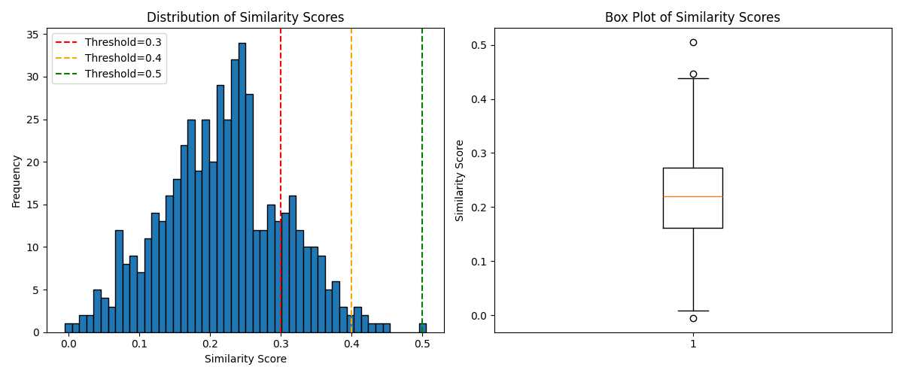

# Analyzing published standards/guidelines for data work
A thematic analysis published standards/policies related to data work.

## Methods

### Policy selection
We review 13 published documents that outline demands, standards, or recommendations for data work. We define data work as consisting of data collection, data curation, data annotation, model training, model evaluation, data verification, and content moderation.

The 13 documents were selected based on our team's knowledge of existing policies published by organizations advocating for data workers globally.

### Framework development
We developed a framework through which to analyze the existing policies. This framework was developed by TechEquity researchers and was informed by our knowlegde of existing worker protection frameworks, documented issues and discussions within the realm of ethical data work in the AI data supply chain, and accumulated knowledge and research about this industry.

### Policy analysis
We leverage both manual and programmatic techniques for our analysis. First, we pre-process the documents by extracting the raw text from PDF versions of each policy. We then prepare the raw text for analysis by removing punctuation, making the text lowercase, tokenizing the text, removing stop words, and stemming/lemmatizing the text (i.e., breaking down words to their root). We then use a pre-trained language model from the Sentence-Transformers module (a.k.a[SBERT](https://sbert.net)) to generate embeddings (numerical vectors that capture semantic meaning) for the processed text. Embeddings are also generated for each parameter in our framework. We then calculate similarity scores between each policy and each parameter in our framework, using cosine similarity as our similarity metric. We plot the distribution of similarity scores to determine a reasonable similarity score threshold, which we deem to be 0.3.

We then split each policy's text into smaller chunks in order to extract relevant passages for each framework parameter. We generate embeddings for these smaller chunks, calculate similarity scores (we again use cosine similarity by default), and pull out the top 3 most similar chunks of text for each parameter.

In doing this, we extract 1,599 total passages. When we filter by the threshold of 0.3, we generate 764 total passages.

