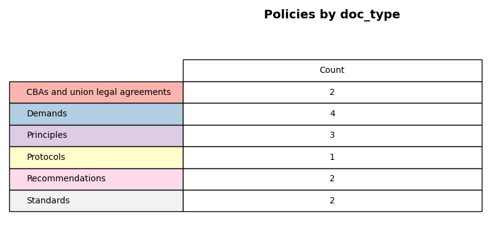

# Analyzing standards for fair and ethical data work
An analysis of published standards, policies, demands, and guidelines related to data work.

## Methods

### Policy selection
We review 13 published documents that outline demands, standards, or recommendations for data work. We define data work as consisting of data collection, data curation, data annotation, model training, model evaluation, data verification, and content moderation.

The 13 documents were selected based on our team's knowledge of existing policies published by organizations advocating for data workers globally.

We categorize the policy documents by document type, organization type, worker focus, and geography. We also get a word count for each document.

**Document type**

**Organization type**

**Worker focus**

**Geography**

**Word Count**

### Framework development
We developed a framework through which to analyze the existing policies. This framework was developed by TechEquity researchers and was informed by our knowlegde of existing worker protection frameworks, documented issues and discussions within the realm of ethical data work in the AI data supply chain, and accumulated knowledge and research about this industry.

**Framework**

### Text processing and semantic search
We leverage natural language processing techniques to process text and measure adherence to our framework. We use a pre-trained language model from the Sentence-Transformers library (a.k.a [SBERT](https://sbert.net)) to generate embeddings (numerical vectors that capture semantic meaning) for the policy document texts and the parameters in our framework. 

We use semantic search to query each policy document text, extract relevant sentences, and measure adherence to the framework. In this process, each policy document is split into its individual sentences. These sentences represent the corpus to be searched/queried.

To define our query parameters, we test two strategies: 
- 1. Each query is the paramater defintion
- 2. Each query is the parameter defintion + a set of keywords related to the parameter

We find that strategy 1, using definitions only, yields a higher average similarity score across the top 5 most relevant sentences per parameter (0.3610 versus 0.3356). 

**Similarity Scores**

This average similarity score becomes our threshold for measuring adherence against each framework parameter. We extract the top 5 matching sentences for all queries for each policy document. If any of the matching sentences contains a similarity score greater than or equal to 0.3610, the policy is categorized as satisfying that parameter (1). Otherwise, it is categorized as not satisfying that parameter (0).

**Manual Review**
For any parameter with scores above the threshold, we conducted a manual review to ensure the extracted sentences were indeed relevant to the parameter. 

## Analysis

