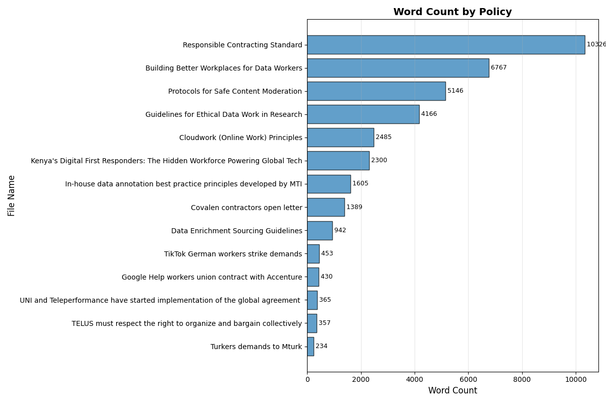

# Analyzing standards for fair and ethical data work
An analysis of published standards, policies, demands, and guidelines related to data work.

## Methods

### Policy selection
We review 13 published documents that outline demands, standards, or recommendations for data work. We define data work as consisting of data collection, data curation, data annotation, model training, model evaluation, data verification, and content moderation.

The 13 documents were selected based on our team's knowledge of existing policies published by organizations advocating for data workers globally.

We categorize the policy documents by document type, organization type, worker focus, and geography. We also get a word count for each document.

**Document type**

**Organization type**

**Worker focus**

**Geography**

**Word Count**

### Framework development
We developed a framework through which to analyze the existing policies. This framework was developed by TechEquity researchers and was informed by our knowlegde of existing worker protection frameworks, documented issues and discussions within the realm of ethical data work in the AI data supply chain, and accumulated knowledge and research about this industry.

### Text processing
We leverage both manual and programmatic techniques for our analysis. First, we prepare the raw text for analysis by removing punctuation, making the text lowercase, tokenizing the text, removing stop words, and stemming/lemmatizing the text (i.e., breaking down words to their root).

We then use a pre-trained language model from the Sentence-Transformers library (a.k.a [SBERT](https://sbert.net)) to generate embeddings (numerical vectors that capture semantic meaning) for the processed text. Embeddings are also generated for each parameter in our framework. We then calculate similarity scores between each policy and each parameter in our framework, using cosine similarity as our similarity metric. 

We plot the distribution of similarity scores to determine a reasonable similarity score threshold. We choose a threshold of 0.35, which represents roughly the 90th percentile of scores.

## Analysis

